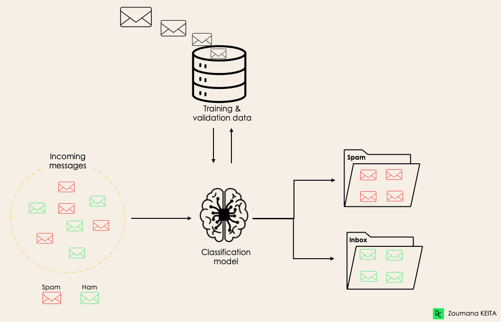

```{r setup, include=FALSE}
knitr::opts_chunk$set(echo = T,
                      fig.align='center',
                      cache=TRUE,
                      out.width = "60%",
                      out.heigth = "60%",
                      warning=FALSE,
                      message=FALSE)
options(width =70)

library(tibble)
library(dplyr)
library(tidyverse)
```

## Exercício 01


a) Problema de Classificação

Em problemas de classificação, o objetivo é prever a categoria de um certo dado fornecido com base em suas características. 
O algoritmo aprende a mapear as entradas (vetores de características) usando as informações passadas para eventualmente classificar esses dados nas saídas (rótulos).

## Aplicações Possíveis:

### Diagnóstico Médico:

- Descrição: Classificar pacientes como tendo ou não uma determinada doença com base em exames médicos.

- Vetores de Características: Resultados de exames (por exemplo níveis de glicose, pressão arterial, idade, peso).

- Rótulos: Diagnóstico positivo (1) ou negativo (0).

### Filtro de Spam:

- Descrição: Classificar e-mails como spam ou não spam.

- Vetores de Características: Frequência de palavras específicas, presença de links, endereço de e-mail.

- Rótulos: Spam (1) ou não spam (0).

```{r, out.width="50%"}

```

b) Problema de Regressão
Em problemas de regressão, o objetivo é prever (portanto são usados em modelos preditivos) um valor contínuo com base em variáveis das quais tal valor é dependente, ou seja, costuma ser usado para previsão de tendências.
O algoritmo aprende a mapear as entradas (vetores de características) para definir as saídas (valores contínuos). 

## Aplicações Possíveis:

### Previsão de Preços de Imóveis:

- Descrição: Prever o preço de uma casa com base em suas características.

- Vetores de Características: Tamanho da casa, número de quartos, localização, número de vagas.

- Resposta: Preço do imóvel (veja, é um valor contínuo).

### Previsão de Temperatura: 

- Descrição: Prever a temperatura em uma determinada localização e horário.

- Vetores de Características: Dados meteorológicos (por exemplo pressão atmosférica, umidade, velocidade do vento).

- Resposta: Temperatura.

### Previsão de Demanda:

- Descrição: Prever a demanda por um produto em um determinado período.

- Vetores de Características: Histórico de vendas, preço do produto, época do ano, menções em redes sociais.

- Resposta: Intensidade da demanda.

c) Problema de Agrupamento (Clustering)

Em problemas de agrupamento, o objetivo é agrupar dados semelhantes em clusters sem a necessidade de rótulos pré-definidos.
O algoritmo aprende a mapear as entradas (vetores de características) para identificar padrões de dados.

Aplicações Possíveis:

### Segmentação de Produtos:

- Descrição: Agrupar produtos com base em comportamentos de compra (por exemplo lâmina de barbear e creme de barbear).

- Vetores de Características: Histórico de compras, produtos comprados juntos, produtos no carrinho, função do produto.

- Resposta: Grupos de produtos.

### Organização de Documentos:

- Descrição: Agrupar documentos semelhantes para facilitar a busca e organização.

- Vetores de Características: Frequência de palavras, tópicos, autoria.

- Resposta: Grupos de documentos.

### Fontes:

- https://www.datacamp.com/blog/classification-machine-learning
- https://www.seldon.io/machine-learning-regression-explained
- https://www.sciencedirect.com/topics/engineering/clustering-problem


## Exercício 02

A "maldição da dimensionalidade" é um termo usado para descrever os desafios e problemas que surgem ao trabalhar com dados em espaços de alta dimensão.
Conforme o número de dimensão dos dados aumenta, o volume do espaço amostral cresce EXPONENCIALMENTE, o que pode levar a uma série de dificuldades:

- Esparsidade dos Dados: Os dados tendem a se tornar cada vez mais esparsos. Isso significa que a distância média entre os pontos aumenta, e a densidade dos dados diminui, tornando difícil identificar padrões ou relações significativas.

- Aumento da Complexidade Computacional: Algoritmos de aprendizado de máquina e técnicas de análise de dados se tornam mais caros à medida que o número de dimensões cresce. Exigindo tempos de processamento mais longos e a necessidade de mais recursos computacionais.

- Overfitting: Em modelos de aprendizado de máquina, o aumento do número de dimensões pode levar ao overfitting, onde o modelo se ajusta muito bem aos dados de treinamento, mas performa mal em dados novos e não vistos.

- Distâncias entre Pontos: Em espaços de alta dimensão, a noção de distância entre pontos pode se tornar menos útil. Todas as distâncias entre pares de pontos tendem a se tornar semelhantes, o que pode afetar negativamente algoritmos que dependem de medidas de distância, como k-vizinhos mais próximos (k-NN).

Para ilustrar um destes problemas (esparsidade de dados), um bom exemplo seria uma trilha:

Suponhamos que sua intenção é saber aproximadamente por quais pontos uma trilha passa.
Se esta trilha tem mais ou menos 50 metros e você tem vinte e cinco sensores distribuidos uniformemente relatando em que ponto estão, vai ter uma ideia boa de sua trajetória, uma vez que o espaço contiínuo máximo desconhecido vai ser de 2 metros.
No entanto, se esta trilha tiver 15 quilômetros, haverão trechos desconhecidos que se estendem por centenas de metros já que agora será uma distância de 600 metros entre cada um dos sensores.
Assim, e usando essa analogia para explicar um dos ônus da "maldição", quanto maior a trilha maior a necessidade de mais sensores para que se mantenha a precisão e cobertura deste caminho.

# Fontes: 

- https://www.youtube.com/watch?v=QZ0DtNFdDko
- https://proceedings.neurips.cc/paper_files/paper/2018/file/b534ba68236ba543ae44b22bd110a1d6-Paper.pdf
- https://medium.com/data-hackers/maldição-da-dimensionalidade-655e4342d64

## Exercício 03

``` {r}

knn_eucledean <- function(k, x, D) {
  D %>%
    mutate(dist = (x[1] - x_1)^2 + (x[2] - x_2)^2) %>%
    arrange(dist) %>%
    head(k) %>%
    count(y, sort = TRUE) %>%
    slice(1) %>%
    pull(y)
}

library(tibble)

set.seed(42)
D <- tibble(
  x_1 = rnorm(100, 1, 1),
  x_2 = rnorm(100, -1, 2),
  y = factor(sample(c("one", "two", "three"), 100, replace = TRUE))
)

head(D)
```
``` {r}
k <- 10


v1 <- c(1, 2)
knn_eucledean(k, v1, D)

v2 <- c(2, 1)
knn_eucledean(k, v2, D)

v3 <- c(0, 1)
knn_eucledean(k, v3, D)

v4 <- c(-2, -3)
knn_eucledean(k, v4, D)
```

## Exercício 04

``` {r}
data("iris") # Carrega o banco no ambiente global

iris <- as_tibble(iris) %>% # Converte para a dataframe tibble
  
select(Petal.Length,Sepal.Length,Species) %>% # Seleciona colunas da dataframe
  
rename( x_1 = Petal.Length, x_2 = Sepal.Length, y = Species) # Renomeia as colunas

head(iris)
```
```{r}
l_iris <- as.list(iris)

accuracy <- function(k) {
  predictions <- pmap_lgl(l_iris, function(x_1, x_2, y) {
  predicted <- knn_eucledean(k, c(x_1, x_2), iris)
    return(predicted == y)
  })
  
  correct_predictions <- sum(predictions)
  total_predictions <- length(predictions)
  
  accuracy <- (correct_predictions / total_predictions) * 100
  return(list(correct_predictions = correct_predictions, total_predictions = total_predictions, accuracy = accuracy))
}


accuracy_k10 <- accuracy(10)
accuracy_k1 <- accuracy(1)

cat("Total de acertos para k = 10:", accuracy_k10$correct_predictions, "de", accuracy_k10$total_predictions ,"ocorrencias \n")
cat("Acuracia para k = 10:", accuracy_k10$accuracy, "%\n")

cat("Total de acertos para k = 1:", accuracy_k1$correct_predictions, "de", accuracy_k1$total_predictions ,"ocorrencias \n")
cat("Acuracia para k = 1:", accuracy_k1$accuracy, "%\n")
```